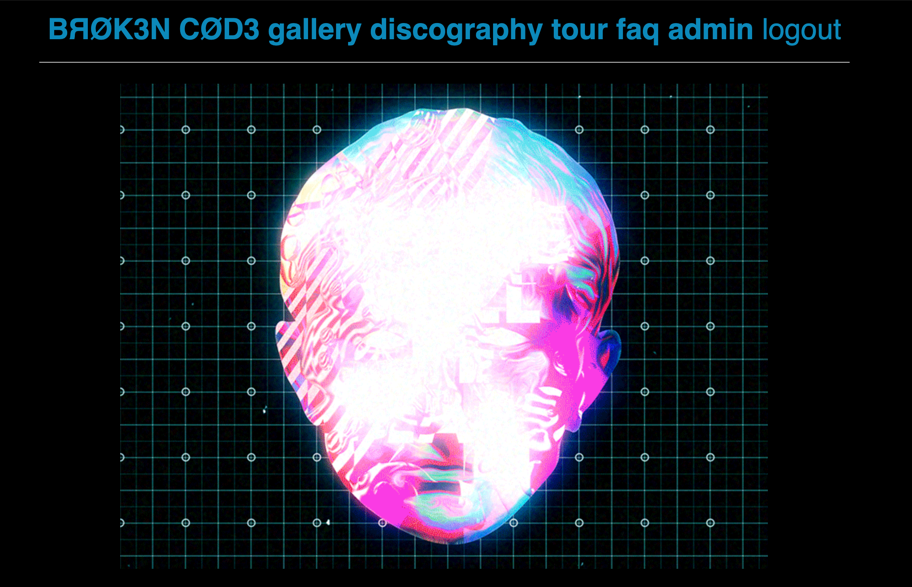

# Project 2: Interactive Full-Stack Web Application - Customized Band Page

## Purpose

The purpose of this project was to create a website that could be utilized for an up and coming musician who is building a fan base. 

Some features of the site are:
- Interactive UI created with MVC, MySQL, Sequelize, Express, Handlebars, and dotenv. Handlebars was used as the framework for the CSS and JQuery was utilized for website functionality. 
- User has the ability to input tours and albums 

The site can be found at: https://github.com/pacoavocado/groupproject_2

---

## Appearance

### Here is an example of the site upon first visit:

---
## Credits

This site was created by Gulshun Eswani, Micah Conn, and Patrick Price with the assistance/guidance of Dane Edwards and Andrew Layendecker. 